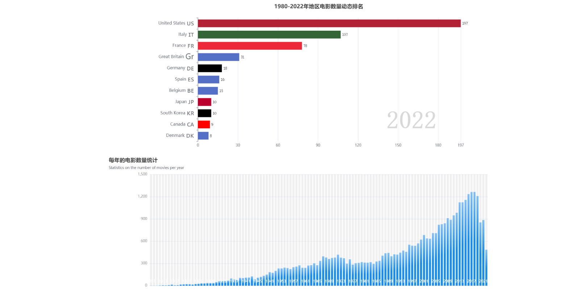
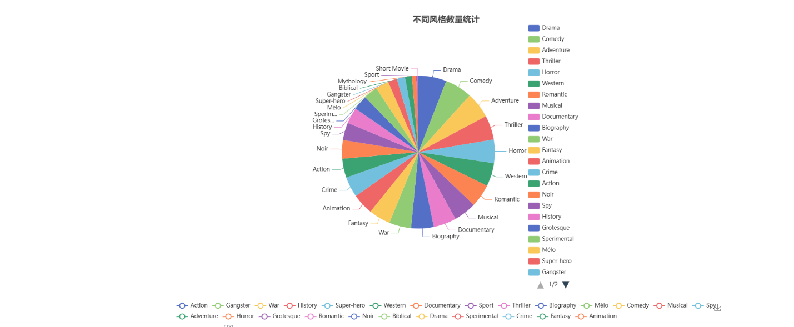
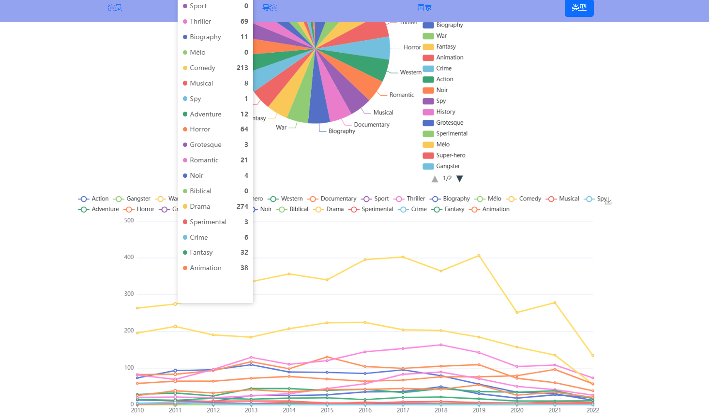
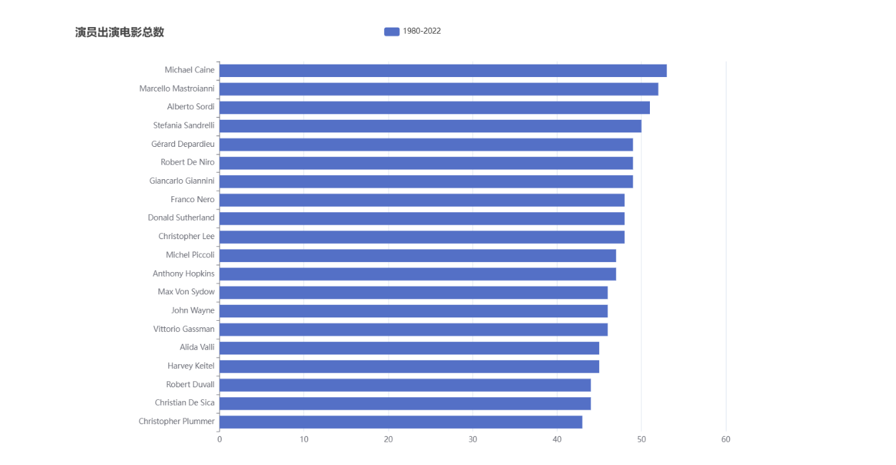
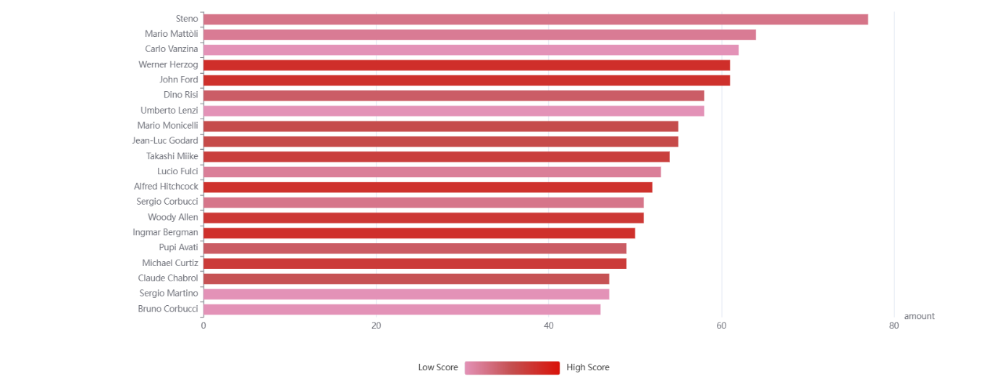

# Movie Big Data Analysis System

## Project Description

This project is a movie big data analysis system developed during a production internship at Neusoft. The objective of the project is to analyze large-scale movie datasets and extract useful insights about the film industry. The system processes movie data from 1989 to 2023 and performs multiple statistical analyses, including movie genres distribution, trends in movie production, and the influence of directors and actors on movie ratings. The results are visualized through interactive charts to help understand movie market trends and support decision making.

## Technologies Used

- Hadoop
- HDFS
- HBase
- Apache Spark
- Scala
- Spark SQL
- MySQL
- Spring Boot
- MyBatis
- ECharts
- HTML5 / CSS3 / JavaScript

## System Architecture

The system consists of four main modules:

1. **Data Collection and Processing**
   Movie datasets are collected from public sources and uploaded to HDFS.
2. **Data Analysis**
   Spark and Spark SQL are used to process and analyze the data. Data cleaning, filtering, and transformation are performed to prepare the dataset for analysis.
3. **Data Storage**
   Processed data is stored in HBase and MySQL databases.
4. **Data Visualization**
   A web application built with Spring Boot retrieves the processed data and displays the results using ECharts for interactive visualization.

## Data Processing

The dataset contains information about more than 37,000 movies, including:

- Title
- Year
- Genre
- Duration
- Country
- Directors
- Actors
- Average rating
- Critics rating
- Public rating

Data preprocessing includes:

- Removing duplicate records
- Cleaning invalid or missing values
- Splitting multi-value fields (such as multiple directors or actors)
- Converting data into structured formats for analysis

## Data Analysis

Several analytical tasks were performed, including:

- Distribution of movie genres
- Movie production trends by year
- Top actors by number of movies
- Relationship between movie duration and ratings
- Average ratings by country
- Ranking of directors based on average ratings

Machine learning models were also tested for prediction, including:

- Linear Regression
- Random Forest
- Gradient Boosting Regression

These models were used to explore possible prediction of movie ratings and trends.

## Visualization

- ## Visualization

The system provides an interactive web interface to display the results of movie big data analysis. Charts and graphs are generated using ECharts to present insights about the movie industry.

### Movie Production Trend

This module shows the trend of movie production over the years from 1989 to 2022. It helps understand how the film industry evolved over time.

### Genre Distribution

This module analyzes the distribution of movie genres, showing which genres are most popular and how they change over time.

### Top Actors

This module shows the total number of movies each actor has appeared in, highlighting the most active actors.

###  Ratings Analysis

This module explores the relationship between movie features and ratings.

## Future Improvements

The system can be further improved by:

- Integrating more datasets from additional movie platforms
- Implementing a movie recommendation system
- Improving prediction models using more features and user ratings
- Enhancing the visualization interface for better user experience

## Author

Huang Xian
Computer Science Graduate
Guilin University of Electronic Technology